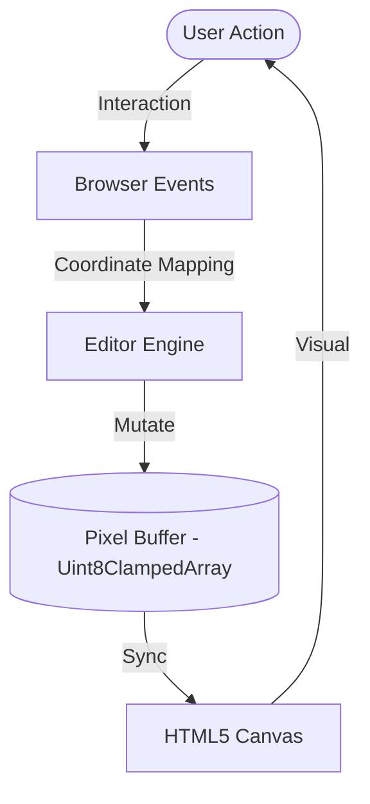
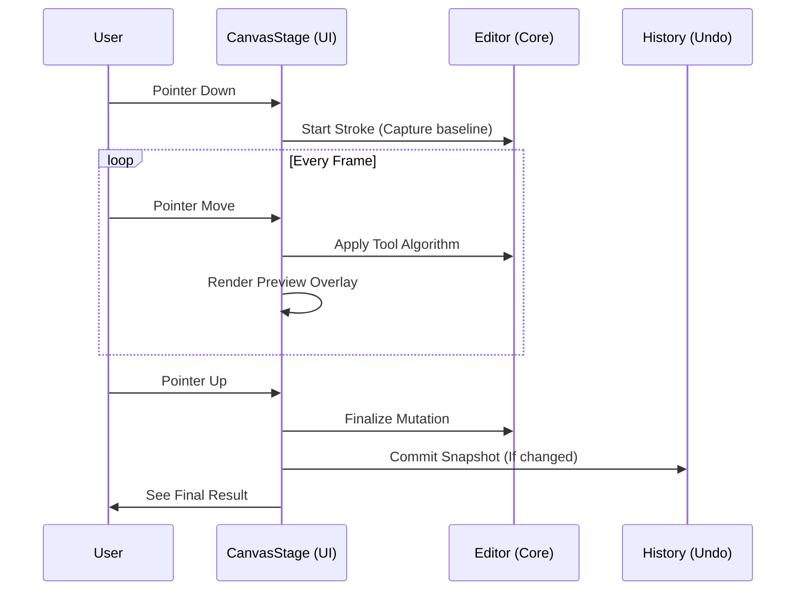
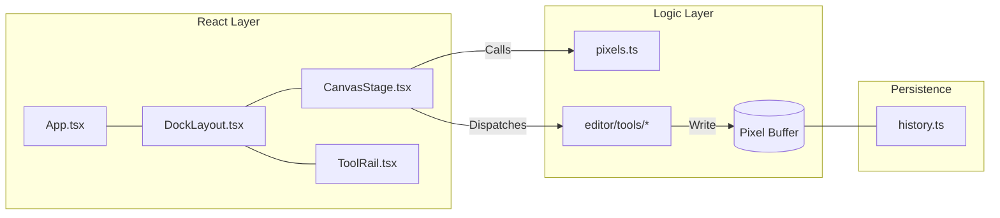

# SpriteAnvil Mental Model

This guide helps you visualize how SpriteAnvil works. If you understand these three diagrams, you understand the engine.

## 1. The "Holy Trinity"

SpriteAnvil is build on the relationship between your mouse, the memory, and the screen.

## 2. The Tool Life Cycle

Every tool (Pen, Fill, Rectangle) follows this heartbeat.

## 3. Data Ownership

Who owns what?

---

> [!TIP]
> **Key Takeaway**: React handles the "Shell" (buttons, sliders, windows), but the "Heart" (the pixels) lives in raw JavaScript memory for maximum speed.
