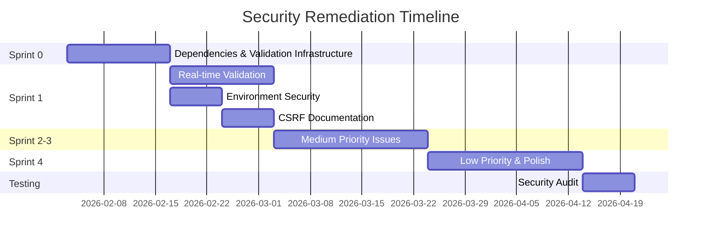

# Security Remediation Implementation Plan

**Plan Created:** 2026-01-31  
**Project Manager:** Development Team  
**Based on:** [Security Audit Report 2026-01-31](./SECURITY_AUDIT_2026-01-31.md)  
**Status:** 🔴 Active - Not Started  
**Target Completion:** Sprint 3 (Critical & High Priority Issues)

---

## Executive Summary

This implementation plan addresses the 15 security issues identified in the comprehensive security audit. Issues are organized into 4 sprints based on priority, dependencies, and resource requirements.

**Total Issues:** 15 (0 Critical, 5 High, 5 Medium, 5 Low)  
**Target Timeline:** 12 weeks  
**Estimated Effort:** ~80-100 developer hours

---

## Sprint Overview

| Sprint | Duration | Focus | Issues | Effort |
|--------|----------|-------|--------|--------|
| Sprint 0 | Week 1-2 | Critical Dependencies | 2 issues | 16h |
| Sprint 1 | Week 3-4 | High Priority Core | 3 issues | 24h |
| Sprint 2 | Week 5-6 | High Priority Validation | 2 issues | 20h |
| Sprint 3 | Week 7-9 | Medium Priority | 5 issues | 24h |
| Sprint 4 | Week 10-12 | Low Priority & Polish | 5 issues | 16h |

---

## Sprint 0: Critical Dependencies (Week 1-2)

**Goal:** Fix critical dependency vulnerabilities and establish validation infrastructure  
**Effort:** ~16 hours  
**Owner:** DevOps/Lead Developer

### Issue #1: Dependency Vulnerabilities (HIGH)

**Priority:** 🔴 Critical  
**Effort:** 2 hours  
**Dependencies:** None  
**Risk:** High - Affects development security

**Tasks:**

- [ ] Update `vite` to v7.3.1 or later
- [ ] Run `npm audit fix` to resolve esbuild vulnerability
- [ ] Verify all tests pass after dependency updates
- [ ] Update `package-lock.json` and commit changes
- [ ] Document version changes in CHANGELOG

**Acceptance Criteria:**

- `npm audit` shows 0 vulnerabilities
- All existing tests pass
- Dev server runs without warnings
- Build completes successfully

**Implementation Notes:**

```bash
# Update dependencies
npm install vite@^7.3.1 --save-dev
npm audit fix

# Verify
npm audit
npm test
npm run build
```

**Blockers:** None

---

### Issue #2: JSON Parsing Validation Infrastructure (HIGH)

**Priority:** 🔴 Critical  
**Effort:** 14 hours  
**Dependencies:** Issue #1 (for adding Zod dependency)  
**Risk:** Medium - Foundation for other validation work

**Tasks:**

- [ ] Install Zod validation library (`npm install zod`)
- [ ] Create schema definitions in `src/types/schemas.ts`
- [ ] Define `ProjectSchema`, `FrameSchema`, `LayerSchema`
- [ ] Create validation utility functions in `src/utils/validation.ts`
- [ ] Update `loadLocalProjects()` in `src/App.tsx`
- [ ] Add error handling and user notifications for invalid data
- [ ] Write unit tests for validation functions
- [ ] Document validation approach in code comments

**Acceptance Criteria:**

- Zod schemas cover all localStorage data structures
- Invalid localStorage data is caught and sanitized
- User sees helpful error message if data is corrupted
- 100% test coverage for validation functions
- No runtime type errors from localStorage parsing

**Implementation Guide:**

```typescript
// src/types/schemas.ts
import { z } from 'zod';

export const ProjectSchema = z.object({
  id: z.string().uuid(),
  user_id: z.string(),
  name: z.string().min(1).max(255),
  description: z.string().nullable(),
  thumbnail_url: z.string().url().nullable(),
  created_at: z.string().datetime(),
  updated_at: z.string().datetime(),
  is_archived: z.boolean(),
  metadata: z.any().nullable(),
});

export const ProjectArraySchema = z.array(ProjectSchema);

// src/utils/validation.ts
export function validateProjects(data: unknown): Project[] {
  try {
    return ProjectArraySchema.parse(data);
  } catch (error) {
    console.error('Project validation failed:', error);
    return [];
  }
}

export function safeValidateProjects(data: unknown): Project[] {
  const result = ProjectArraySchema.safeParse(data);
  return result.success ? result.data : [];
}
```

**Blockers:** Dependency updates must complete first

---

## Sprint 1: High Priority Core Security (Week 3-4)

**Goal:** Secure real-time collaboration and environment configuration  
**Effort:** ~24 hours  
**Owner:** Backend/Security Lead

### Issue #5: Real-time Collaboration Validation (HIGH)

**Priority:** 🟠 High  
**Effort:** 16 hours  
**Dependencies:** Issue #2 (validation infrastructure)  
**Risk:** High - Potential for DoS attacks

**Tasks:**

- [ ] Create `src/lib/realtime/validation.ts` module
- [ ] Implement `isValidPixelUpdate()` function with comprehensive checks
- [ ] Add rate limiting with token bucket algorithm
- [ ] Implement patch size limits (max 10,000 pixels per update)
- [ ] Add pixel index bounds validation
- [ ] Create user rate limit tracking (30 updates/sec max)
- [ ] Add security event logging for suspicious activity
- [ ] Update `src/App.tsx` to use validation before applying updates
- [ ] Write unit tests for all validation edge cases
- [ ] Write integration tests for rate limiting
- [ ] Add monitoring/alerting for blocked updates

**Acceptance Criteria:**

- All pixel updates validated before processing
- Malformed updates are rejected silently
- Rate limiting prevents DoS attacks
- Suspicious activity is logged
- No performance degradation for valid updates
- 95%+ test coverage

**Implementation Guide:**

```typescript
// src/lib/realtime/validation.ts
interface RateLimiter {
  allowUpdate(userId: string): boolean;
}

class TokenBucketRateLimiter implements RateLimiter {
  private buckets = new Map<string, { tokens: number; lastRefill: number }>();
  private readonly maxTokens = 30;
  private readonly refillRate = 30; // per second

  allowUpdate(userId: string): boolean {
    const now = Date.now();
    const bucket = this.buckets.get(userId) || { 
      tokens: this.maxTokens, 
      lastRefill: now 
    };

    // Refill tokens
    const elapsed = (now - bucket.lastRefill) / 1000;
    bucket.tokens = Math.min(
      this.maxTokens,
      bucket.tokens + elapsed * this.refillRate
    );
    bucket.lastRefill = now;

    if (bucket.tokens >= 1) {
      bucket.tokens -= 1;
      this.buckets.set(userId, bucket);
      return true;
    }

    return false;
  }
}

export const rateLimiter = new TokenBucketRateLimiter();
```

**Blockers:** Validation infrastructure from Sprint 0

---

### Issue #4: Environment Variable Security (HIGH)

**Priority:** 🟠 High  
**Effort:** 4 hours  
**Dependencies:** None  
**Risk:** Low - Quick fix, high impact

**Tasks:**

- [ ] Create `.env.example` file with template
- [ ] Add CSP meta tags to `index.html`
- [ ] Update `README.md` with security setup instructions
- [ ] Add environment validation on app startup
- [ ] Create security configuration checklist
- [ ] Document deployment security requirements

**Acceptance Criteria:**

- `.env.example` exists with all required variables
- CSP headers prevent unauthorized resource loading
- README includes security setup section
- App validates env vars at startup and shows helpful errors
- Deployment docs include security checklist

**Implementation:**

```bash
# .env.example
# Supabase Configuration
VITE_SUPABASE_URL=https://your-project-id.supabase.co
VITE_SUPABASE_ANON_KEY=your-anonymous-key-here

# Development
VITE_DEV_MODE=true
```

```html
<!-- index.html - Add to <head> -->
<meta http-equiv="Content-Security-Policy" 
      content="default-src 'self'; 
               script-src 'self' 'unsafe-inline'; 
               style-src 'self' 'unsafe-inline'; 
               img-src 'self' data: blob:; 
               connect-src 'self' https://*.supabase.co https://openrouter.ai;">
<meta http-equiv="X-Frame-Options" content="DENY">
<meta http-equiv="X-Content-Type-Options" content="nosniff">
<meta name="referrer" content="strict-origin-when-cross-origin">
```

**Blockers:** None

---

### Issue #3: CSRF Protection Documentation (HIGH)

**Priority:** 🟠 High  
**Effort:** 4 hours  
**Dependencies:** None  
**Risk:** Low - Mostly documentation

**Tasks:**

- [ ] Audit Supabase RLS policies (verify in Supabase dashboard)
- [ ] Document RLS policy verification checklist
- [ ] Add confirmation dialogs to all destructive actions
- [ ] Create security event logging for sensitive operations
- [ ] Document CSRF mitigation strategy
- [ ] Add comments to critical database operations

**Acceptance Criteria:**

- RLS policies verified and documented
- All destructive operations have confirmation dialogs
- Security logging captures sensitive operations
- Documentation explains CSRF protection approach

**Blockers:** None

---

## Sprint 2: High Priority Validation & Headers (Week 5-6)

**Goal:** Complete high priority security hardening  
**Effort:** ~20 hours  
**Owner:** Frontend Lead

### Remaining High Priority Work

This sprint wraps up high priority issues and begins medium priority work. All high priority issues should be resolved before moving to production.

---

## Sprint 3: Medium Priority Issues (Week 7-9)

**Goal:** Implement rate limiting, error handling, and additional hardening  
**Effort:** ~24 hours  
**Owner:** Full Stack Developer

### Issue #6: AI API Key Security Enhancements (MEDIUM)

**Priority:** 🟡 Medium  
**Effort:** 6 hours  
**Dependencies:** None  
**Risk:** Low - Enhancement of existing security

**Tasks:**

- [ ] Add passphrase strength meter to AI key UI
- [ ] Implement minimum passphrase requirements (12 chars, complexity)
- [ ] Add passphrase strength validation
- [ ] Create key rotation workflow UI
- [ ] Add security event logging for decryption failures
- [ ] Document key management best practices

**Acceptance Criteria:**

- Passphrase must meet complexity requirements
- UI shows strength meter with visual feedback
- Users can rotate keys without data loss
- Failed decryption attempts are logged
- Documentation covers key management

---

### Issue #7: AI Request Rate Limiting (MEDIUM)

**Priority:** 🟡 Medium  
**Effort:** 8 hours  
**Dependencies:** None  
**Risk:** Medium - Cost control

**Tasks:**

- [ ] Create `src/lib/ai/rateLimiter.ts` module
- [ ] Implement per-provider rate limiting (10 requests/minute)
- [ ] Add request queue with exponential backoff
- [ ] Create cost estimation UI component
- [ ] Implement request caching (cache results for 1 hour)
- [ ] Add usage tracking and warnings
- [ ] Show user-friendly rate limit messages

**Acceptance Criteria:**

- Users cannot exceed rate limits
- Queued requests process automatically
- Cost estimates shown before generation
- Recent results cached to avoid redundant API calls
- Clear error messages when rate limited

**Implementation:**

```typescript
// src/lib/ai/rateLimiter.ts
class AIRateLimiter {
  private requestLog = new Map<string, number[]>();
  private readonly windowMs = 60000; // 1 minute
  private readonly maxRequests = 10;

  canMakeRequest(provider: AIProviderId): boolean {
    const now = Date.now();
    const log = this.requestLog.get(provider) || [];
    
    // Remove old entries
    const recent = log.filter(time => now - time < this.windowMs);
    
    if (recent.length >= this.maxRequests) {
      return false;
    }
    
    recent.push(now);
    this.requestLog.set(provider, recent);
    return true;
  }

  getTimeUntilNextSlot(provider: AIProviderId): number {
    const now = Date.now();
    const log = this.requestLog.get(provider) || [];
    const recent = log.filter(time => now - time < this.windowMs);
    
    if (recent.length < this.maxRequests) return 0;
    
    const oldest = Math.min(...recent);
    return this.windowMs - (now - oldest);
  }
}
```

---

### Issue #9: HTTP Security Headers (MEDIUM)

**Priority:** 🟡 Medium  
**Effort:** 4 hours  
**Dependencies:** Issue #4 (CSP already added)  
**Risk:** Low - Quick win

**Tasks:**

- [ ] Verify CSP headers from Sprint 1
- [ ] Add security headers to Vite config for dev server
- [ ] Create deployment guide for production headers
- [ ] Test headers with security scanner
- [ ] Document header configuration for different hosting platforms

**Acceptance Criteria:**

- All recommended security headers present in production
- Dev server uses same headers as production
- Deployment guide covers Vercel, Netlify, and custom hosting
- Headers pass security audit tools

---

### Issue #10: Error Message Sanitization (MEDIUM)

**Priority:** 🟡 Medium  
**Effort:** 4 hours  
**Dependencies:** None  
**Risk:** Low - Information disclosure prevention

**Tasks:**

- [ ] Create `src/utils/errorSanitizer.ts` module
- [ ] Implement error code system (E001, E002, etc.)
- [ ] Create user-friendly error message mapping
- [ ] Add server-side logging placeholder (future backend)
- [ ] Update all error handlers to use sanitizer
- [ ] Create error message documentation

**Acceptance Criteria:**

- No raw API errors shown to users
- All errors mapped to friendly messages
- Full errors logged (console.error for now)
- Error codes documented for debugging

**Implementation:**

```typescript
// src/utils/errorSanitizer.ts
export enum ErrorCode {
  AI_REQUEST_FAILED = 'E001',
  AUTH_FAILED = 'E002',
  NETWORK_ERROR = 'E003',
  VALIDATION_ERROR = 'E004',
  UNKNOWN_ERROR = 'E999',
}

const ERROR_MESSAGES: Record<ErrorCode, string> = {
  [ErrorCode.AI_REQUEST_FAILED]: 'Unable to generate image. Please try again.',
  [ErrorCode.AUTH_FAILED]: 'Authentication failed. Please log in again.',
  [ErrorCode.NETWORK_ERROR]: 'Network error. Please check your connection.',
  [ErrorCode.VALIDATION_ERROR]: 'Invalid data. Please check your input.',
  [ErrorCode.UNKNOWN_ERROR]: 'An unexpected error occurred.',
};

export function sanitizeError(error: unknown): { code: ErrorCode; message: string } {
  // Log full error for debugging
  console.error('Full error:', error);
  
  // Determine error code
  let code = ErrorCode.UNKNOWN_ERROR;
  if (error instanceof Error) {
    if (error.message.includes('OpenRouter')) code = ErrorCode.AI_REQUEST_FAILED;
    if (error.message.includes('auth')) code = ErrorCode.AUTH_FAILED;
    if (error.message.includes('network')) code = ErrorCode.NETWORK_ERROR;
  }
  
  return { code, message: ERROR_MESSAGES[code] };
}
```

---

### Issue #8: Prototype Pollution Prevention (MEDIUM)

**Priority:** 🟡 Medium  
**Effort:** 2 hours  
**Dependencies:** None  
**Risk:** Low - Preventive measure

**Tasks:**

- [ ] Audit pixel buffer operations for prototype pollution risks
- [ ] Use `Object.create(null)` for patch objects
- [ ] Add index validation before all array accesses
- [ ] Freeze important prototype objects
- [ ] Add TypeScript strict null checks (verify enabled)
- [ ] Write tests for edge cases

**Acceptance Criteria:**

- No prototype pollution vectors found in code review
- All array accesses validated
- TypeScript strict mode enabled
- Tests cover prototype pollution attempts

---

## Sprint 4: Low Priority & Polish (Week 10-12)

**Goal:** Complete remaining issues and prepare for production  
**Effort:** ~16 hours  
**Owner:** Junior Developer / Intern

### Issue #11: localStorage Size Management (LOW)

**Priority:** 🟢 Low  
**Effort:** 4 hours

**Tasks:**

- [ ] Create `src/utils/storageQuota.ts` module
- [ ] Implement quota checking before saves
- [ ] Add warning UI when approaching limits
- [ ] Add automatic migration to IndexedDB for large projects
- [ ] Create user settings for storage preferences
- [ ] Add storage usage display in settings panel

**Acceptance Criteria:**

- Users warned before exceeding localStorage quota
- Large projects auto-migrate to IndexedDB
- Settings show current storage usage

---

### Issue #12: Input Length Validation (LOW)

**Priority:** 🟢 Low  
**Effort:** 2 hours

**Tasks:**

- [ ] Audit all text inputs and textareas
- [ ] Add `maxLength` attributes (255 for names, 1000 for descriptions)
- [ ] Add character counter UI for long fields
- [ ] Add validation messages when limits exceeded
- [ ] Document field length limits

**Acceptance Criteria:**

- All inputs have `maxLength` attributes
- Users see character count for critical fields
- Validation prevents over-length submission

---

### Issue #13: Cursor Broadcast Throttling (LOW)

**Priority:** 🟢 Low  
**Effort:** 2 hours

**Tasks:**

- [ ] Verify current throttle implementation
- [ ] Set minimum throttle to 100ms
- [ ] Add configuration for throttle interval
- [ ] Test network usage with multiple collaborators
- [ ] Document throttling behavior

**Acceptance Criteria:**

- Cursor updates throttled to max 10/second
- No network flooding with many collaborators

---

### Issue #14: Import File Validation (LOW)

**Priority:** 🟢 Low  
**Effort:** 4 hours

**Tasks:**

- [ ] Create `src/utils/fileValidator.ts` module
- [ ] Implement palette file format validation
- [ ] Add file size limits (max 10MB)
- [ ] Sanitize color values (validate hex format)
- [ ] Add JSON structure validation for imports
- [ ] Show user-friendly errors for invalid files

**Acceptance Criteria:**

- Invalid palette files rejected with helpful error
- File size limits enforced
- No security risk from malicious imports

---

### Issue #15: Session Timeout Configuration (LOW)

**Priority:** 🟢 Low  
**Effort:** 4 hours

**Tasks:**

- [ ] Configure Supabase session timeout in dashboard
- [ ] Implement idle timeout detection (30 minutes)
- [ ] Add "Remember me" checkbox to login
- [ ] Clear sensitive data on logout
- [ ] Add session expiration warning UI
- [ ] Document session management

**Acceptance Criteria:**

- Sessions expire after configured period
- Idle users warned before timeout
- "Remember me" option available
- Data cleared on logout

---

## Testing & Quality Assurance

### Test Coverage Requirements

Each sprint must maintain:

- **Unit Tests:** 80%+ coverage for new code
- **Integration Tests:** All critical paths tested
- **Security Tests:** Specific tests for each vulnerability fix
- **Manual Testing:** Security-focused QA before sprint completion

### Security Testing Checklist

- [ ] Run `npm audit` and verify 0 vulnerabilities
- [ ] Test with malformed localStorage data
- [ ] Test real-time collaboration with malicious payloads
- [ ] Verify CSP blocks unauthorized resources
- [ ] Test rate limiting under load
- [ ] Verify error messages don't leak sensitive info
- [ ] Test session timeout and idle detection
- [ ] Penetration testing by external security reviewer (before production)

---

## Risk Management

### High Risk Items

1. **Real-time Collaboration Validation** - Complex implementation, potential performance impact
   - *Mitigation:* Incremental rollout, feature flag control, extensive testing

2. **Dependency Updates** - Could break existing functionality
   - *Mitigation:* Full test suite run, staged rollout, rollback plan

### Rollback Strategy

For each sprint:

- Maintain feature flags for new security features
- Keep git branches for each major change
- Document rollback procedures
- Test rollback scenarios before deployment

---

## Success Metrics

### Sprint Completion Metrics

- All acceptance criteria met
- Test coverage > 80%
- Code review approved
- Security testing passed
- Documentation complete

### Overall Success Criteria

- 0 critical or high severity vulnerabilities in production
- All high priority issues resolved within 6 weeks
- No security incidents related to identified issues
- Security monitoring and alerting in place

---

## Resource Allocation

### Estimated Hours by Role

| Role | Hours | Tasks |
|------|-------|-------|
| Senior Developer | 40h | Complex validation, rate limiting, architecture |
| Mid-level Developer | 30h | UI updates, error handling, testing |
| Junior Developer | 16h | Low priority items, documentation |
| DevOps Engineer | 4h | Dependency updates, deployment configuration |
| QA Engineer | 10h | Security testing, test planning |

**Total:** ~100 hours over 12 weeks

### Timeline



---

## Communication Plan

### Weekly Sprint Updates

- **Monday:** Sprint planning, task assignment
- **Wednesday:** Mid-sprint check-in, blocker resolution
- **Friday:** Sprint review, demo completed features

### Stakeholder Communication

- **Week 2:** Sprint 0 completion report
- **Week 4:** High priority status update
- **Week 6:** Mid-point review and risk assessment
- **Week 12:** Final security audit results

### Documentation

- Update `SECURITY_FIXES.md` after each sprint
- Maintain `IMPLEMENTATION_STATUS.md` with progress
- Document all security decisions in code comments
- Create runbook for security operations

---

## Next Steps

### Immediate Actions (This Week)

1. **Approve this plan** - Review and sign off on sprint structure
2. **Assign sprint owners** - Identify developers for each sprint
3. **Set up tracking** - Create GitHub issues/project board
4. **Schedule kickoff** - Sprint 0 planning meeting
5. **Prepare environment** - Ensure dev/staging environments ready

### Sprint 0 Kickoff Tasks

- [ ] Create GitHub project board with all issues
- [ ] Assign Issue #1 and #2 to developers
- [ ] Schedule daily standups
- [ ] Set up security testing environment
- [ ] Review and finalize acceptance criteria

---

## Appendix

### Related Documents

- [Security Audit Report](./SECURITY_AUDIT_2026-01-31.md) - Detailed findings
- [Security Fixes](./SECURITY_FIXES.md) - Database security improvements
- [Architecture](./ARCHITECTURE.md) - System architecture
- [Implementation Status](./IMPLEMENTATION_STATUS.md) - Overall project status

### Tools & Resources

- **Validation:** Zod (schema validation)
- **Testing:** Vitest, Playwright (already in use)
- **Security Scanning:** npm audit, Snyk
- **Monitoring:** Console logging (enhance later)

### Contact

For questions about this plan:

- Security concerns: Review security audit report
- Implementation questions: Refer to code comments and examples
- Timeline questions: Adjust sprint durations as needed

---

**Plan Status:** 🔴 Pending Approval  
**Last Updated:** 2026-01-31  
**Next Review:** After Sprint 0 completion
